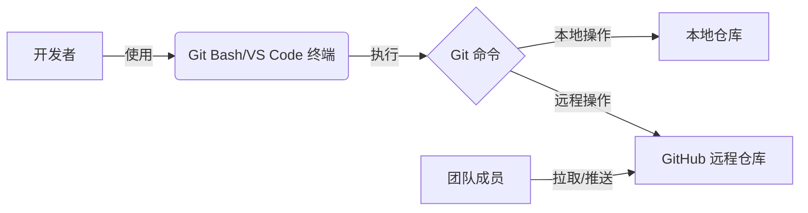

# 深度解析：Git、GitHub 与本地仓库协作全流程

## 一、核心概念拆解

### （一）克隆仓库（Clone）
**定义**：从远程仓库（如 GitHub）复制完整项目到本地的过程，包含代码文件、版本历史、分支信息。

**作用**：
- 创建本地开发环境，支持离线编辑
- 保留完整版本记录，便于历史回溯
- 支持多分支并行开发

**操作示例**（终端命令）：
```bash
# 使用 SSH 协议克隆（需提前配置密钥）
git clone git@github.com:用户名/仓库名.git

# 使用 HTTPS 协议克隆（无需密钥，但每次推送需输入账号密码）
git clone https://github.com/用户名/仓库名.git
```

**克隆后目录结构**：
```
project/           # 项目根目录
├── .git/          # Git 版本控制目录（隐藏）
├── src/           # 源代码目录
├── README.md      # 项目说明文件
└── package.json   # 项目配置文件（示例）
```


### （二）本地仓库 vs 远程仓库
| **对比项**         | **本地仓库**                     | **远程仓库（如 GitHub）**         |
|--------------------|----------------------------------|-----------------------------------|
| **存储位置**       | 开发者本地硬盘                   | 云端服务器（GitHub 等平台）       |
| **核心功能**       | 离线开发、版本管理               | 代码托管、团队协作、CI/CD 集成    |
| **常用命令**       | `git commit`, `git branch`       | `git push`, `git pull`, `git clone` |
| **典型场景**       | 个人开发、版本迭代               | 代码共享、PR 审查、发布管理       |

**关系图解**：
```
本地仓库 ↔️ 远程仓库（GitHub）
  │            │
  └─ 提交       └─ 推送/拉取
```


### （三）Git 与 Git Bash
#### 1. Git
- **本质**：分布式版本控制系统（DVCS）
- **核心功能**：
  - 跟踪文件变更
  - 管理版本历史
  - 支持分支开发与合并
  - 离线操作
- **核心命令**：
  ```bash
  git add         # 添加文件到暂存区
  git commit      # 提交到本地仓库
  git push        # 推送到远程仓库
  git pull        # 从远程拉取更新
  git branch      # 分支管理
  git merge       # 合并分支
  ```

#### 2. Git Bash
- **定义**：Windows 平台下的命令行工具，提供类 Unix 终端环境
- **作用**：
  - 执行 Git 命令
  - 支持 Linux 命令（如 `ls`, `cd`, `grep`）
  - 解决 Windows 路径与 Linux 路径的兼容性问题
- **替代方案**：
  - VS Code 内置终端
  - Windows Terminal + Git
  - PowerShell + Git


### （四）暂存（Stage）、提交（Commit）、同步更改（Push）
#### 1. 暂存（`git add`）
**作用**：将工作区的修改添加到暂存区（Index），准备提交。

**示例**：
```bash
git add README.md           # 暂存单个文件
git add src/                # 暂存目录下所有文件
git add .                   # 暂存所有修改（常用）
```

**暂存区意义**：
- 选择性提交：可只提交部分修改
- 分批次提交：将相关修改分组提交
- 避免误提交：确保提交内容符合预期

#### 2. 提交（`git commit`）
**作用**：将暂存区的内容保存到本地仓库，生成版本记录。

**示例**：
```bash
# 带提交信息的标准提交
git commit -m "修复登录页按钮样式问题"

# 跳过暂存区，直接提交工作区修改（需谨慎使用）
git commit -am "快速提交"

# 追加到上次提交（修改上次提交信息或补充内容）
git commit --amend
```

**提交规范**：
- 提交信息应简洁明了（50 字符以内）
- 使用祈使句（如 "Add feature" 而非 "Added feature"）
- 复杂提交可添加详细描述（换行后填写）

#### 3. 同步更改（`git push`）
**作用**：将本地仓库的提交推送到远程仓库。

**示例**：
```bash
# 首次推送，关联本地分支到远程分支
git push -u origin main

# 常规推送
git push

# 推送指定分支
git push origin feature/new-module
```

**推送失败常见原因**：
- 网络连接问题
- 远程仓库有新提交（需先 `git pull`）
- 权限不足（SSH 密钥配置错误）


### （五）SSH 协议与密钥对
#### 1. SSH 协议
- **定义**：安全外壳协议，用于在不安全网络中进行安全通信
- **Git 中的作用**：替代 HTTPS 协议，提供更安全的远程仓库访问方式
- **优势**：
  - 无需每次输入用户名密码
  - 加密传输，防止中间人攻击
  - 支持多账户管理

#### 2. 密钥对（公钥/私钥）
| **类型** | **存储位置** | **用途**                          | **安全性要求**         |
|----------|--------------|-----------------------------------|------------------------|
| 私钥     | 本地电脑     | 身份验证（类似钥匙）              | 严格保密，不共享       |
| 公钥     | GitHub 等平台 | 配对验证（类似锁）                | 可公开，但需关联账户   |

#### 3. 配置流程
**生成密钥对**：
```bash
# 生成 ED25519 类型密钥（推荐）
ssh-keygen -t ed25519 -C "your_email@example.com"

# 按提示选择存储位置（默认 ~/.ssh/id_ed25519）
# 可设置密码保护（可选）
```

**添加公钥到 GitHub**：
```bash
# 复制公钥内容
cat ~/.ssh/id_ed25519.pub

# 登录 GitHub → Settings → SSH and GPG keys → New SSH key
# 粘贴公钥内容，添加标题（如 "My Laptop"）
```

**测试连接**：
```bash
ssh -T git@github.com

# 成功输出示例：
# Hi username! You've successfully authenticated, but GitHub does not provide shell access.
```


## 二、为什么需要 “本地仓库中转”？
### （一）分布式版本控制的核心优势
#### 1. 离线开发能力
- **场景**：飞机、地铁等无网络环境
- **工作流**：
  ```mermaid
  graph TD
    A[无网络] --> B[本地修改代码]
    B --> C[git commit 保存到本地仓库]
    C --> D[联网后 git push 同步到远程]
  ```

#### 2. 版本安全保障
- 本地仓库保存完整版本历史
- 即使远程仓库数据丢失，仍可通过本地恢复
- 示例：
  ```bash
  # 查看本地提交历史
  git log --oneline

  # 回退到历史版本
  git checkout <commit-hash>
  ```

#### 3. 灵活的分支管理
- 本地创建分支无需网络
- 多任务并行开发互不干扰
- 示例：
  ```bash
  # 创建并切换到新分支
  git checkout -b feature/new-login

  # 开发完成后合并到主分支
  git checkout main
  git merge feature/new-login
  ```


### （二）编辑器直接连接 GitHub 的局限性
| **问题**         | **具体表现**                               | **本地仓库解决方案**                     |
|------------------|------------------------------------------|----------------------------------------|
| 网络依赖         | 必须联网才能编辑代码                     | 本地仓库支持离线开发，联网后同步        |
| 版本管理能力弱   | 编辑器难以实现复杂版本控制（如分支、合并） | Git 提供专业版本管理工具                |
| 协作冲突风险高   | 多人同时编辑同一文件易冲突               | 本地提交前可通过 `git pull` 解决冲突    |
| 操作不可逆       | 在线编辑错误后难以回退                   | 本地仓库支持 `git revert` 等回退操作    |


## 三、Git、Git Bash、GitHub 三者关系
### （一）角色定位
| **工具**       | **角色**                          | **核心功能**                                      |
|----------------|-----------------------------------|---------------------------------------------------|
| **Git**        | 版本控制引擎                      | 跟踪文件变更、管理版本历史、分支合并等            |
| **Git Bash**   | 命令行界面（Windows 平台）        | 提供类 Unix 终端环境，执行 Git 命令               |
| **GitHub**     | 远程协作平台                      | 托管 Git 仓库、提供 Web 界面、支持团队协作工作流  |

### （二）协作流程


### （三）常见交互场景
| **场景**               | **涉及工具**        | **典型命令/操作**                     |
|------------------------|---------------------|--------------------------------------|
| 初始化项目             | Git + GitHub        | `git init` → `git remote add` → `git push` |
| 日常开发               | Git + Git Bash      | `git add` → `git commit` → `git push`    |
| 代码审查               | GitHub              | 创建 Pull Request → 在线审查 → 合并    |
| 解决冲突               | Git + VS Code       | `git pull` → 手动解决冲突 → `git commit` |


## 四、完整协作流程实践（VS Code + Git + GitHub）
### （一）初始化：从克隆到本地开发
#### 1. 克隆远程仓库
```bash
# 使用 SSH 协议克隆
git clone git@github.com:用户名/仓库名.git

# 进入项目目录
cd 仓库名
```

#### 2. 配置本地仓库
```bash
# 设置用户名和邮箱（仅首次需要）
git config --local user.name "Your Name"
git config --local user.email "your_email@example.com"

# 查看配置信息
git config --list
```

#### 3. 在 VS Code 中打开项目
- 方法一：VS Code → 文件 → 打开文件夹 → 选择克隆的目录
- 方法二：在终端中执行：
  ```bash
  code .
  ```


### （二）日常开发：修改 → 暂存 → 提交 → 推送
#### 1. 修改文件
在 VS Code 中编辑文件（如 `README.md`, `src/main.js`），保存修改（`Ctrl+S`）。

#### 2. 暂存修改
**图形界面操作**：
1. 点击左侧活动栏的源代码管理图标（或按 `Ctrl+Shift+G`）
2. 在 “更改” 列表中，点击文件旁的 `+` 号暂存

**终端命令操作**：
```bash
# 暂存所有修改
git add .

# 查看暂存状态
git status
```

#### 3. 提交到本地仓库
**图形界面操作**：
1. 在 “消息” 框中输入提交说明
2. 点击对勾 `✔️` 按钮提交

**终端命令操作**：
```bash
# 标准提交
git commit -m "添加用户登录功能"

# 查看提交历史
git log --oneline
```

#### 4. 推送到远程仓库
**图形界面操作**：
1. 点击源代码管理面板顶部的 “推送” 按钮

**终端命令操作**：
```bash
# 首次推送需关联上游分支
git push -u origin main

# 后续推送直接执行
git push
```


### （三）团队协作：拉取更新与解决冲突
#### 1. 拉取远程更新
```bash
# 拉取远程最新代码并合并到当前分支
git pull

# 等价于先 fetch 再 merge
git fetch
git merge origin/main
```

#### 2. 解决冲突
当拉取的代码与本地修改冲突时：
```bash
# 查看冲突文件
git status

# 手动编辑冲突文件（VS Code 会标记冲突位置）
<<<<<<< HEAD
// 本地修改内容
=======
// 远程修改内容
>>>>>>> branch-name

# 编辑后添加并提交
git add 冲突文件
git commit -m "解决合并冲突"
```


### （四）分支管理实战
#### 1. 创建并切换分支
```bash
# 创建新分支并立即切换到该分支
git checkout -b feature/new-module

# 等价于以下两条命令
git branch feature/new-module
git checkout feature/new-module
```

#### 2. 查看分支列表
```bash
# 查看本地分支
git branch

# 查看远程分支
git branch -r

# 查看所有分支（本地+远程）
git branch -a
```

#### 3. 合并分支
```bash
# 切换回主分支
git checkout main

# 合并指定分支到当前分支
git merge feature/new-module

# 合并后删除已完成的分支
git branch -d feature/new-module
```


## 五、常见问题排查与优化
### （一）权限问题
#### 1. SSH 连接失败
```bash
# 测试 SSH 连接
ssh -T git@github.com

# 若提示 "Permission denied"，检查：
- 私钥文件是否存在（~/.ssh/id_ed25519）
- 公钥是否正确配置到 GitHub
- SSH 代理是否已启动（eval $(ssh-agent -s)）
```

#### 2. HTTPS 每次都要求输入密码
```bash
# 配置凭据缓存（有效期 1 小时）
git config --global credential.helper 'cache --timeout=3600'
```


### （二）提交失败
#### 1. 远程仓库有新提交
```bash
# 先拉取远程更新
git pull

# 若有冲突，解决冲突后再提交
git add .
git commit -m "合并远程更新"
git push
```

#### 2. 提交信息不符合规范
```bash
# 修改上次提交信息
git commit --amend -m "新的提交信息"
```


### （三）回退操作
#### 1. 撤销工作区修改
```bash
# 丢弃某个文件的修改
git checkout -- 文件路径

# 丢弃所有未暂存的修改
git checkout -- .
```

#### 2. 撤销暂存区修改
```bash
# 将文件从暂存区撤回到工作区
git reset HEAD 文件路径
```

#### 3. 回退提交
```bash
# 软回退（保留修改，回到提交前状态）
git reset --soft HEAD^

# 硬回退（彻底删除提交）
git reset --hard HEAD^
```


## 六、总结：从工具到协作的完整逻辑
### （一）核心价值
1. **Git**：提供分布式版本控制能力，让代码变更可追溯、可管理
2. **Git Bash**：在 Windows 平台提供类 Unix 终端环境，高效执行 Git 命令
3. **GitHub**：构建云端协作平台，支持团队开发、代码审查、持续集成

### （二）协作流程闭环


